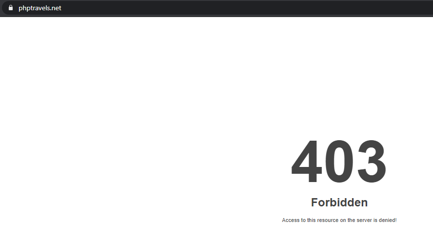
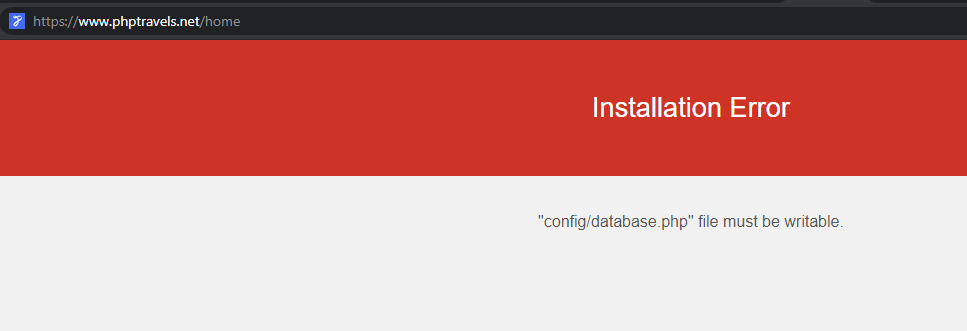

### 
#### I performed web UI automation for PHP Travels hotel search feature. I built a test automation solution using pycharm, pytest and selenium webdriver. I am performing validation of the home page and search results.

#### Prerequisites:
[Home Page Link]( https://www.phptravels.net/home)

Please make sure you have **Python** installed [link](https://www.python.org/downloads/)

Please make sure you have **PyCharm** installed [link](https://www.jetbrains.com/pycharm/download/)

Create a project and give it a name. Now add the necessary packages. 

To install the necessary packages using **PyCharm GUI** (on **Windows 10**):

1. Open your project in **PyCharm**.
2. Click on **File -> Settings**.
3. In the search field type in **Interpreter**.
4. In the new window, click on **+** sign to add new packages.
5. Type in **selenium** and click on **Install Package**.
6. Type in **pytest** and click on **Install Package**.
7. Click on **Project -> Python Interpreter** to select your desired interpreter
7. Close Packages and Settings windows.

Make sure you have the packages installed otherwise you won't be able to import the modules and run your tests.

You can run your test via terminal. 
```
pytest -v filename

pytest -v (to run all other tests you have in the folder)
```


**Reports**
To generate test automation report you only need to install allure-pytest package.

Then navigate to the tests directory terminal and run the following commands:
```
py.test --alluredir=%Reports% ./test_file_name.py

allure serve %Reports%
```

Navigate to File(top right corner of Pycharm) and click on Settings. Click on Project Interpreter. Click on the **+** symbol and type in allure in the search box. Select allure-pytest and click on **install package**.


### If you prefer to run certain tests, then navigate to the tests folder in this repository and run the following script:
```
pytestrun.sh
```

### To run a specific test from the **pytestrun.sh** script, just copy the command you need.
```
# Alzer Hotel Istanbul, Istanbul
# home page
py.test --alluredir=%Reports% ./test_navigation_tria.py
# 2 adults 0 children
py.test --alluredir=%Reports% ./test_search_tria.py
# 2 adults 2 children
py.test --alluredir=%Reports% ./test_search_tria_children_increase.py
# 0 adults 0 children
py.test --alluredir=%Reports% ./test_search_tria_adult_decrease.py

# Tria Hotel Istanbul Especial, Istanbul
# home page
py.test --alluredir=%Reports% ./test_navigation_alzer.py
# 2 adults 0 children
py.test --alluredir=%Reports% ./test_search_alzer.py
# 2 adults 2 children
py.test --alluredir=%Reports% ./test_search_alzer_children_increase.py
# 0 adults 0 children
py.test --alluredir=%Reports% ./test_search_alzer_adult_decrease.py
```

### Don't forget to run the following command to view your report
```
allure serve %Reports%
```


### Virtual environment

Its best practice to separete dependencies with a virtual environment.

Navigate to the tests folder and run the following commands:
```
setupenv.sh
``` 


### Parallel test execution
The only way to achieve truly continuous testing with web UI tests is to run them in parallel. **pytest-xdist** is a plugin that lets you scale up by increasing the test thread count and scale out by distributing test execution to remote machines. Pass -n auto to use as many processes as your computer has CPU cores.:
```
pytest -n auto
```


#### Test case description: 

Test the Hotels search feature


### Test Data:

| ID | Hotel | Checkin | Checkout | Adults | Children |
|----|-------|---------|----------|--------|----------|
| 1 | Alzer Hotel Istanbul, Istanbul | 10/29/2020 | 10/31/2020 | 2 | 0 |
| 2 | Alzer Hotel Istanbul, Istanbul | 12/29/2020 | 12/31/2020 | 2 | 0 |
| 3 | Alzer Hotel Istanbul, Istanbul | 12/30/2020 | 12/29/2020 | 2 | 0 |
| 4 | Alzer Hotel Istanbul, Istanbul | 10/29/2020 | 10/31/2020 | 2 | 2 |
| 5 | Alzer Hotel Istanbul, Istanbul | 12/29/2020 | 12/31/2020 | 2 | 2 |
| 6 | Alzer Hotel Istanbul, Istanbul | 12/30/2020 | 12/29/2020 | 2 | 2 |
| 7 | Alzer Hotel Istanbul, Istanbul | 10/29/2020 | 10/31/2020 | 0 | 0 |
| 8 | Alzer Hotel Istanbul, Istanbul | 12/29/2020 | 12/31/2020 | 0 | 0 |
| 9 | Alzer Hotel Istanbul, Istanbul | 12/30/2020 | 12/29/2020 | 0 | 0 |
| 10 | Tria Hotel Istanbul Especial, Istanbul | 10/29/2020 | 10/31/2020 | 2 | 0 |
| 11 | Tria Hotel Istanbul Especial, Istanbul | 12/29/2020 | 12/31/2020 | 2 | 0 |
| 12 | Tria Hotel Istanbul Especial, Istanbul | 12/30/2020 | 12/29/2020 | 2 | 0 |
| 13 | Tria Hotel Istanbul Especial, Istanbul | 10/29/2020 | 10/31/2020 | 2 | 2 |
| 14 | Tria Hotel Istanbul Especial, Istanbul | 12/29/2020 | 12/31/2020 | 2 | 2 |
| 15 | Tria Hotel Istanbul Especial, Istanbul | 12/30/2020 | 12/29/2020 | 2 | 2 |
| 16 | Tria Hotel Istanbul Especial, Istanbul | 10/29/2020 | 10/31/2020 | 0 | 0 |
| 17 | Tria Hotel Istanbul Especial, Istanbul | 12/29/2020 | 12/31/2020 | 0 | 0 |
| 18 | Tria Hotel Istanbul Especial, Istanbul | 12/30/2020 | 12/29/2020 | 0 | 0 |


#### Scenario 1:


Given the user is on the homepage

And they have chosen the Hotels option

And they have selected Hotel

And they have selected checkin , checkout  

And they have selected Adults , Children

When they click search

Then matching results are displayed


#### Scenario 2:


Given the user is on the homepage

And they have chosen the Hotels option

When they click search

Then they will receive an error message to missing fields


### Alzer:

Test case 1

Expected Results: Alzer hotel search result should be displayed
Actual Results: No matching result is displayed
Pass/Fail: Fail

Test case 2

Expected Results: Alzer hotel search result should be displayed
Actual Results: No matching result is displayed
Pass/Fail: Fail

Test case 3

Expected Results: Search results should not be displayed. User should recieve error message to add valid dates and adult/children
Actual Results: List of hotels is displayed
Pass/Fail: Fail

#### Tria:

Test case 1

Expected Results: Tria hotel search result should be displayed
Actual Results: As expected
Pass/Fail: Pass

Test case 2

Expected Results: Tria hotel search result should be displayed
Actual Results: As expected
Pass/Fail: Pass

Test case 3

Expected Results: Search results should not be displayed. User should recieve error message to add valid dates and adult/children
Actual Results: Tria hotel is displayed
Pass/Fail: Fail


Perfomance Issues:

Reliabilty: Fail
Security: Fail






